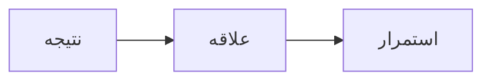
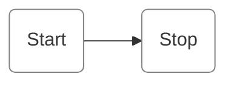
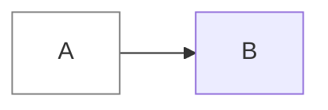
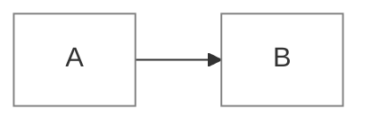
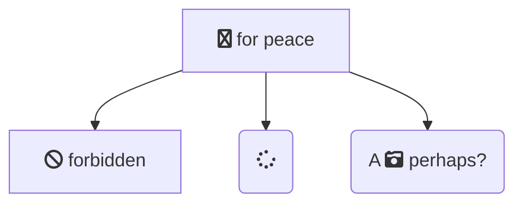
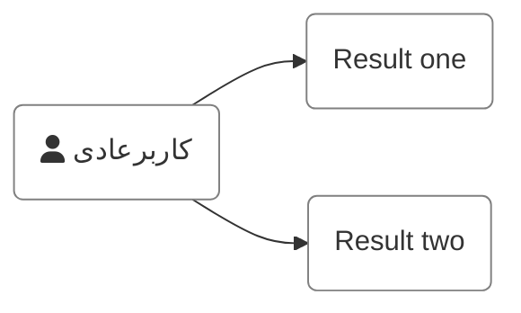
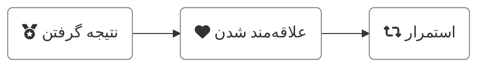
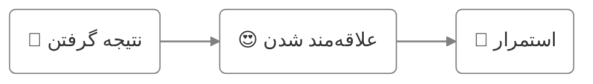
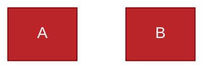
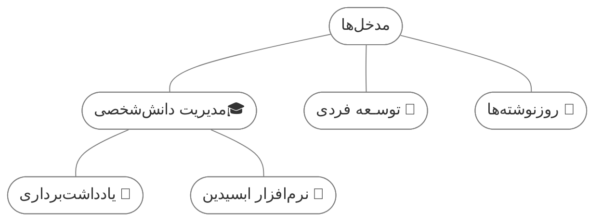

```mermaid
flowchart LR
نتیجه --> علاقه --> استمرار
```


<br/>



```mermaid
flowchart LR
    id1(Start)-->id2(Stop)
    style id1 fill:#fff,stroke:gray
    style id2 fill:#fff,stroke:gray

```


<br/>



```mermaid
flowchart LR
    A:::someclass --> B
    classDef someclass fill:#fff,stroke:gray

```



```mermaid
flowchart LR
    A --> B
    classDef default fill:#fff,stroke:gray

```



```mermaid
flowchart TD
    B["fa:fa-twitter for peace"]
    B-->C[fa:fa-ban forbidden]
    B-->D(fa:fa-spinner)
    B-->E(A fa:fa-camera-retro perhaps?)

```

<br/><br/>


```mermaid
flowchart LR
	id1(fa:fa-user کاربرعادی)
    id1 --> D(Result one)
    id1 --> E(Result two)
    classDef default fill:#fff,stroke:gray

```


<br/><br/>


## cod

```
html
css
```


<br/><br/>


```mermaid
flowchart LR
A("fa:fa-medal نتیجه گرفتن") --> B("fa:fa-heart علاقه‌مند شدن") --> C(fa:fa-retweet استمرار)
classDef default fill:#fff,stroke:gray

```


<br/><br/>


```mermaid
flowchart LR
A(🥇 نتیجه گرفتن) --> B(😍 علاقه‌مند شدن) --> C(🔁 استمرار)

classDef default fill:#fff,stroke:gray, stroke-width:1px;
linkStyle default stroke:gray,stroke-width:1.5px;
```
<br/><br/>


```mermaid
%%{
  init: {
    'theme': 'base',
    'themeVariables': {
      'primaryColor': '#BB2528',
      'primaryTextColor': '#fff',
      'primaryBorderColor': '#7C0000',
      'lineColor': '#fff',
      'secondaryColor': '#006100',
      'tertiaryColor': '#fff'
    }
  }
}%%

graph LR;
    A-->B;
    click A "quartz-configuration"
    click B "http://www.github.com"

```
<br/><br/>

---


```mermaid
flowchart TD
A([مدخل‌ها])
A --- B([مدیریت دانش‌شخصی🎓])
A --- C([توسـعه فردی 🎯])
A --- D([روزنوشته‌ها 📅])

B --- B1([یادداشت‌برداری 📝])
B --- B2([نرم‌افزار ابسیدین 🔮])

click B1 "note-taking"
click B2 "obsidian"


classDef default fill:#fff,stroke:gray, stroke-width:1px;
linkStyle default stroke:gray,stroke-width:1px;
```
