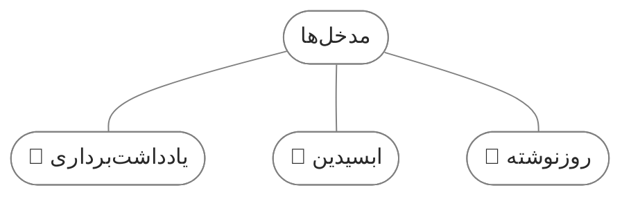

📁 [فایل اصلی](https://github.com/fardm/quartz/blob/v4/content/elements.md)

<br/>

## مواردی که پشتیبانی می‌کند


# تیتر 1
## تیتر 2
### تیتر 3
#### تیتر 4
##### تیتر 5
###### تیتر 6

<br/>

### پاراگراف
لورم ایپسوم متن ساختگی با تولید سادگی نامفهوم از صنعت چاپ، و با استفاده از طراحان گرافیک است، چاپگرها و متون بلکه روزنامه و مجله در ستون و سطرآنچنان که لازم است، و برای شرایط فعلی تکنولوژی مورد نیاز، و کاربردهای متنوع با هدف بهبود ابزارهای کاربردی می باشد.

Lorem ipsum dolor sit amet, consectetur adipiscing elit, sed do eiusmod tempor incididunt ut labore et dolore magna aliqua. Egestas purus viverra accumsan in nisl nisi. Arcu cursus vitae congue mauris rhoncus aenean vel elit scelerisque. In egestas erat imperdiet sed euismod nisi porta lorem mollis. Morbi tristique senectus et netus. Mattis pellentesque id nibh tortor id aliquet lectus proin.

<br/>

### استایل متن
**متن بولد**

~~متن خط خورده~~

*متن ایتالیک*

==متن هایلایت شده==

<br/>

### لینک و تگ

[[obsidian publish|لینک داخلی]]

[لینک خارجی](https://example.com)

`#تست`

<br/>

### لیست

1. یک
2. دو
3. سه


- یک
- دو
- سه

<br/>

### تسک

- [ ] یک
- [x] دو
- [ ] سه

<br/>

### ایموجی

📚 ⭐😍⏰🔥🌱🚀🌿🌳🍿💩😎😘🤬


<br/>

### جدول

| تیتر |                           توضیح                            |
| :--: | :--------------------------------------------------------: |
|  یک  | لورم ایپسوم متن ساختگی با تولید سادگی نامفهوم از صنعت چاپ. |
|  دو  | لورم ایپسوم متن ساختگی با تولید سادگی نامفهوم از صنعت چاپ. |

<br/>


### کد
```js
document.addEventListener('DOMContentLoaded', function () {
    const elements = document.querySelectorAll('p, div, span');
```

```
EmbededCover
```

`code`

<br/>

### نقل قول

> لورم ایپسوم متن ساختگی با تولید سادگی نامفهوم از صنعت چاپ، و با استفاده از طراحان گرافیک است، چاپگرها و متون بلکه روزنامه و مجله در ستون و سطرآنچنان که لازم است، و برای شرایط فعلی تکنولوژی مورد نیاز، و کاربردهای متنوع با هدف بهبود ابزارهای کاربردی می باشد.


<br/>

### کالوت
> [!quote]+ نقل قول
> لورم ایپسوم متن ساختگی با تولید سادگی نامفهوم از صنعت چاپ، و با استفاده از طراحان گرافیک است

> [!example]- مثال
> لورم ایپسوم متن ساختگی با تولید سادگی نامفهوم از صنعت چاپ، و با استفاده از طراحان گرافیک است

> [!info] اطلاعات
> 

> [!NOTE] یادداشت
> 

> [!abstract] خلاصه
> 

> [!tip] نکته

> [!warning] توجه

> [!question] سوال

> [!todo] تو دو

> [!success] تیک

> [!failure] ناموفق

> [!danger] خطر

> [!bug] باگ

<br/>

### تصویر
محلی
![[calendar2.png | 250]]

خارجی


<br/>

### دیاگرام




<br/><br/>

### نوارپیشرفت (progress)

<progress max=100 value=75> </progress> 75%


<br/><br/>

### دکمه (button)

<div style="text-align: center;">
<button 
	style="	background-color: black; color: white; padding: 8px 20px; border: none; border-radius: 10px; cursor: pointer; transition: background-color 0.3s ease;"	onclick="location.href='https://example.com/';">
     کلیک کنید
</button>
</div>


<br/><br/>

### پاورقی

لورم ایپسوم متن ساختگی با تولید سادگی نامفهوم از صنعت چاپ، و با استفاده از طراحان گرافیک است.[^1]

لورم ایپسوم متن ساختگی با تولید سادگی نامفهوم از صنعت چاپ، و با استفاده از طراحان گرافیک است.[^2]

<br/><br/>


[^1]: پاورقی شماره یک.
[^2]: پاورقی شماره دو.


## مواردی که پشتیبانی نمی‌کند

### ریاضی
$$ \begin{vmatrix}a & b\\ c & d \end{vmatrix}=ad-bc $$

<br/>

### کنواس (canvas)

کنواس

<br/>

### پلاگین دیتاویو (dataview)

```dataview
table without id
file.link as "فایل"
from "content/note"
```

(البته میشه از پلاگین [Obsidian Dataview Serializer](https://github.com/dsebastien/obsidian-dataview-serializer) استفاده کرد)

<br/>