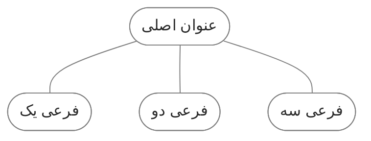

در طول استفاده از کوارتز، به مرور زمان تغییرات و اصلاحات مختلفی برای بهبود و اصلاح عمکلرد سایت انجام دادم. در این یادداشت فهرستی از این تغییرات را مستند کردم. این موارد نخست به عنوان یک مرجع شخصی عمل می‌کند تا در صورت نیاز بتوانم به راحتی تنظیمات قبلی را ویرایش کنم. از طرف دیگر می‌تواند راهنمای مفیدی باشد برای کسانی که تمایل دارند مشابه آن را روی سایت خود پیاده‌سازی کنند.
<br/> <br/>
## یک) اطلاعات مربوط به یادداشت (ContentMeta)

بعد از عنوان مطلب اطلاعاتی مثل تاریخ و زمان تقریبی مطالعه زیر آن نمایش داده می‌شود. من ترجیح دادم این تنظیمات را به آن اضافه کنم:
<br/><br/>
### زمان تقریبی مطالعه
بنا به دلایلی[^1] زمان تقریبی مطالعه را غیر فعال کردم. یک ویرگول هم برای جدا سازی این اطلاعات بین آن ها قرار می‌گرفت که آن را هم مخفی کردم.(باتوجه به استایلی که به آن اعمال کردم بودن آن ضرورتی نداشت) با اضافه کردن دستور زیر به فایل `quartz.layout.ts` نمایش این دو مورد غیرفعال می‌شود:
```
Component.ContentMeta({showReadingTime: false, showComma: false,})
```

<br/>

### تاریخ
به طور پیشفرض کوارتز فقط یک تاریخ را به کاربر نشان می‌دهد که نهایتا می توانید زمان آن را روی تاریخ انتشار یا تاریخ آخرین آپدیت تنظیم کنید. من تمایل داشتم علاوه بر تاریخ انتشار تاریخ آخرین به‌روزرسانی هم برای کاربر قابل مشاهده باشد.[^2] با اضافه کردن کد زیر به فایل `quartz/components/ContentMeta.tsx` این کار قابل انجام است. با این دستور درصورتی که تاریخ انتشار و آخرین به‌روزرسانی یکسان نباشد علاوه بر تاریخ انتشار تاریخ آخرین به‌روزرسانی هم اضافه شده و به کاربر نمایش داده می‌شود.

```
if (text) {
  const segments: (string | JSX.Element)[] = []

  if (fileData.dates) {
	const created = formatDate(getDate(cfg, fileData)!, cfg.locale) 
	const modifed = formatDate(fileData.dates?.modified, cfg.locale)
	if (created == modifed) {
	  segments.push(` 📅 انتشار: ${created} `)
	} else {
	  segments.push(` 📅 انتشار: ${created} `)
	  segments.push(` 🔄 به‌روزرسانی: ${modifed} `)
	}
  }
```

<br/>

### وضعیت رشد
یکی از مواردی که در [[digital garden|سیستم یادداشت برداری دیجیتال گاردن]] استفاده می‌شود مشخص کردن میزان رشد و پیشرفت یادداشت است. نهال، درختچه و همیشه سبز سه موردی است که من برای علامت گذاری وضعیت نوشته استفاده می‌کنم. من ترجیح دادم که این مورد هم در این بخش قابل مشاهده باشد. با اضافه کردن کد زیر به فایل `ContentMeta.tsx` می‌توان این موارد را اضافه کرد. این کد اطلاعات موجود در پراپرتی status را جمع آوری کرده و بعد از تاریخ یادداشت نمایش می‌دهد.

```
  const status = fileData.frontmatter?.status || "نامشخص";
  if (status !== "نامشخص") {
	segments.push(` ${status} `)
  }
```

<br/>

### بهبود استایل
برای این بخش هم یک استایل خاص در نظر گرفتم. یک بک‌گراند خاکستری روشن اضافه کردم که ظاهر بهتر و متمایزی داشته باشد. با اضافه کردن کد زیر به فایل `quartz\styles\custom.scss` این نتیجه اعمال می‌شود.

```
.content-meta>span {
	background-color: var(--lightgray);
	border-radius: 4px;
	padding: 1px 6px 1px 6px;
	margin: 5px;
	font-size: 0.9em;
}

.content-meta {
	color: var(--darkgray);
	display: flex;
	flex-wrap: wrap;
}
```

<br/> 

### حذف اطلاعات از صفحه اول
طبیعتا صفحه اول نیاز به نمایش این اطلاعات ندارد. برای مخفی کردن این موارد از صفحه اول کد زیر را به فایل `ContentMeta.tsx` اضافه کنید. باید بعد از `const text = fileData.text` قرار بگیرد.
```
if (fileData.slug === "index") {
	return <></>
}
```

نمایش عنوان صفحه هم ضرورتی ندارد برای حذف آن کافی است کد بالا را به فایل `quartz/components/ArticleTitle.tsx` اضافه کنید. باید بعد از `const title = fileData.frontmatter?.title` قرار بگیرد.[^3]

<br/> <br/>


## دو) فارسی سازی
خوشبختانه کوارتز از زبان فارسی پشتیبانی می‌کند و با ویرایش فایل `fa-IR.ts` می‌توان از معادل فارسی کلمات استفاده کرد. اما چند مورد وجود دارد که که فارسی سازی نشده:
<br/><br/>

### کلمه Home در Breadcrumbs
کلمه home در Breadcrumbs (مسیر راهنمای سایت) به فارسی تبدیل نشده. با اضافه کردن دستور زیر به فایل `quartz.layout.ts` می توانید کلمه آن را تغییر دهید:

```
    Component.Breadcrumbs({rootName: "خانه",}),
```

 <br/>

### نتیجه جستجو
اگر در باکس جستجو عبارتی را سرچ کنید و آن کلمه در سایت نباشد این متن را نمایش می دهد:
![[searchtext.jpg]]

با ویرایش فایل `search.inline.ts` در مسیر `quartz\components\scripts\search.inline.ts` می‌توانید آن را اصلاح کنید.

```
if (finalResults.length === 0) {
  results.innerHTML = `<a class="result-card no-match">
	  <h3>نتیجه‌ای یافت نشد</h3>
	  <p>عبارت دیگری را امتحان کنید</p>
  </a>`
}
```

<br/>

### عنوان footnote
اگر از پاورقی استفاده کنید به طور پیشفرض یک عنوان با عبارت footnote به انتهای صفحه اضافه می‌شود. در [سایت کریستالین](https://blog.eledah.ir/%D9%BE%D8%B1%D9%88%DA%98%D9%87%E2%80%8C%D9%87%D8%A7/%DB%8C%D8%A7%D8%AF%D8%AF%D8%A7%D8%B4%D8%AA%E2%80%8C%D8%A8%D8%B1%D8%AF%D8%A7%D8%B1%DB%8C/%D8%A7%D8%B2-%DB%8C%D8%A7%D8%AF%D8%AF%D8%A7%D8%B4%D8%AA-%D8%A8%D9%87-%D8%B3%D8%A7%DB%8C%D8%AA-%D8%A8%D8%A7-%DA%A9%D9%88%D8%A7%D8%B1%D8%AA%D8%B2#%D8%AC%D8%A7%DB%8C%DA%AF%D8%B2%DB%8C%D9%86%DB%8C-footnotes-%D8%A8%D8%A7-%D9%BE%D8%A7%D9%86%D9%88%D8%B4%D8%AA-%D8%AF%D8%B1-%D8%A7%D9%86%D8%AA%D9%87%D8%A7%DB%8C-%D9%85%D8%B7%D8%A7%D9%84%D8%A8) یک ترفند برای تغییر متن آن ارائه شده است. با قرار دادن کد زیر در `custom.scss` می توانید آن را با یک متن دیگر جایگزین کنید:

```
h2#footnote-label{
    visibility: hidden;
}
 
h2#footnote-label::after{
    content: "پانوشت‌ها";
    visibility: visible;
    display: block;
}
```

<br/><br/>
## سه) استایل سفارشی
این تنظیمات مربوط به استایل ظاهری سایت است. این کد ها باید در فایل زیر قرار بگیرند:
 `quartz\styles\custom.scss`

### فهرست مطالب و بک لینک
برای تمایز بیشتر بوردر و بک‌گراند خاکستری روشن اضافه کردم. به اول هر سطر هم بولت پوینت اضافه کردم. 

```
// فهرست مطالب
    .toc {
        border-radius: 5px;
        border: 1px solid var(--lightgray);
        padding: 12px; 
        font-size: 0.9rem;
        background-color: #80808017;
    }
    
    #toc-content ul {
        max-height: 360px;
    }
    
    

    #toc-content .depth-0 {
        list-style: disc;
        list-style-position: inside;

    }
    
    #toc-content .depth-1 {
        padding: 0px !important;
        padding-right: 1rem !important;
        list-style: circle;
        list-style-position: inside;
    }
    
    #toc-content .depth-2 {
        padding: 0px !important;
        padding-right: 2rem !important;
    }
    
    #toc-content .depth-3 {
        padding: 0px !important;
        padding-right: 3rem !important;
    }

    #toc-content ul>li>a {
        margin-right: -12px;
        opacity: .45;
    }

 
// بک لینک
    .backlinks>ul {
        border-radius: 5px;
        border: 1px solid var(--lightgray);
        list-style: disc;
        padding-right: 35px;
        padding-top: 10px;
        padding-left: 10px;
        font-size: 0.95rem;
        background-color: #80808017;
        max-height: 230px;
    }

    ul.overflow:after,ol.overflow:after {
        display: none;
    }
```

<br/>

### بلوک کد
در حالت پیشفرض حتی اگر طول یک سطر کوتاه باشد باز هم اسکرول محور افقی نمایش داده می شود. با اضافه کردن کد `overflow-x: auto` اسکرول تنها در صورتی نمایش داده می‌شود که طول سطر طولانی بوده و خارج از بلوک کد باشد.
بقیه تنظیمات مربوط به بک‌گراند، فونت و جهت قرار گفتن متن است.

```
pre {
	background: #afafaf1a;
}

pre>code {
	overflow-x: auto;
}

code {
	direction: ltr !important;
	font-family: var(--bodyFont);
}
```

<br/>

### دیاگرام
در کوارتز مانند ابسیدین امکان ساخت دیاگرام وجود دارد. به این شکل:



در سایت [mermaid](https://mermaid.js.org/intro/) تمامی دستورات برای استفاده از آن توضیح داده شده. کد زیر دیاگرام بالا را نشان می دهد:
````

````

تنظیم استایل دیاگرام در خود کد امکان پذیر است. دو خط آخر کد بالا استایل این دیاگرام را تعریف میکند. علاوه براین تنظیمات دیگری هم به فایل `custom.scss` اضافه کردم:
- دایرکشن را روی rtl گذاشتم، چون معمولا از فارسی استفاده می کنم.
- بک‌گراند را شفاف کردم، چون بک‌گراند code رو خاکستری کرده بودم، دیاگرام هم خاکستری شده بود.
- فونت را روی body font گذاشتم.
- آیکون «کپی در کلیپ بورد» را مخفی کردم.

```
.mermaid {
	direction: rtl !important;
}

pre:has(>code.mermaid) {
	background-color: transparent;
}

.nodeLabel {
	font-family: var(--bodyFont);
}

pre:has(>code.mermaid) .clipboard-button {
	display: none;
}
```

<br/>

### دکمه
با استفاده از تگ `</button>` می توانید از دکمه استفاده کنید. به این شکل:

<div style="text-align: center;">
<button 
	class="my-button"	onclick="window.open('#', '_blank');">
     کلیک کنید
</button>
</div>

کد زیر دکمه بالا را تحویل می دهد:
```
<div style="text-align: center;">
<button 
	class="my-button"	onclick="window.open('https://www.example.com/', '_blank');">
     کلیک کنید
</button>
</div>
```

برای استایل هم این تنظیمات را اضافه کردم:
```
.my-button {
	background-color: var(--tertiary);
	color: white;
	padding: 8px 20px;
	border: none;
	border-radius: 10px;
	cursor: pointer;
	transition: background-color 0.3s ease;
	font-family: var(--bodyFont);
	font-size: 1em;
}  

.my-button:hover {
	background-color: var(--secondary);
}
```

<br/>

### وسط چین کردن فوتر
ترجیح دادم بخش فوتر وسط چین باشد.

```
footer {
	text-align: center;
}

footer>ul {
	justify-content: center;
}
```

<br/>

### چرخش آیکون >
این آیکون در قسمت های مختلف مثل فهرست، اکسپلور و کالوت استفاده شده. جهت این آیکون در حالت بسته باید سمت چپ باشد در حالی که به سمت راست است. برای چرخش آن باید مقدار `rotateZ` را در فایل های مربوط به هر کدام از منفی90 به مثبت90 تغییر دهید.[^4] به این شکل:
```
  &.collapsed .fold {
    transform: rotateZ(90deg);
  }
```

فهرست: `quartz/components/styles/toc.scss`

اکسپلور: `quartz/components/styles/explorer.scss`

کالوت: `quartz/quartz/styles/callouts.scss`

<br/>

### تایپوگرافی
مقداری سایز متن بدنه و هدینگ ها را افزایش دادم. همینطور فاصله بین خطوط.

```
body {
	font-size: 1.1em;
}

p {
	line-height: 2rem;
} 

li {
	line-height: 2rem; 
}

sup {
vertical-align: middle; //اگه توی متن از پانوشت استفاده شده باشه باعث میشه فاصله بین خطوط به هم نریزه
}

h2 {
	font-size: 1.6rem;
	margin-top: 1rem;
	margin-bottom: -0.2rem;
	border-bottom: 1px solid var(--lightgray);
	padding-bottom: 0.2em;
}

h3 {
	font-size: 1.30rem;
	margin-top: 1rem;
	margin-bottom: -0.8rem;
}

h4,
h5,
h6 {
  font-size: 1.1rem;
  margin-top: 1rem;
  margin-bottom: -0.8rem;
}
```

<br/>

### کالوت سفارشی
برای تغییر رنگ کالوت ها می توانید فایل `quartz/quartz/styles/callouts.scss` را ویرایش کنید. علاوه بر این میتوانید کالوت های دیگر با آیکون های دیگر اضافه کنید.
<br/><br/>

## چهار) لینک بازگشت در صفحه 404
صفحه 404 لینک بازگشتی به سایت ندارد و کاربر نمی‌تواند به سایت برگردد. با اضافه کردن کد زیر لینک بازگشت به صفحه اصلی در این صفحه نمایش داده می‌شود.

فایل: `quartz\components\pages\404.tsx`

این کد باید بعد از `<p>{i18n(cfg.locale).pages.error.notFound}</p>` قرار بگیرد:
```
<p>بازگشت به <a href="/">صفحه اصلی</a></p>
```

<iframe width="100%" height="290px" style="border: none;" src="https://ifard.ir/img/before-after-404e.html"></iframe>

<br/> <br/>

## پنج) اضافه کردن آیکون
یک آیکون به عنوان سایت اضافه کردم. کد SVG آیکون را به فایل `quartz\components\PageTitle.tsx` اضافه کردم.
```
  return (
    <h1 class={classNames(displayClass, "page-title")}>
      <a href={baseDir}><svg xmlns="http://www.w3.org/2000/svg" viewBox="0 0 512 512" width="1em" height="1em" fill="currentColor" style="vertical-align: middle;"><path d="M512 32c0 113.6-84.6 207.5-194.2 222c-7.1-53.4-30.6-101.6-65.3-139.3C290.8 46.3 364 0 448 0l32 0c17.7 0 32 14.3 32 32zM0 96C0 78.3 14.3 64 32 64l32 0c123.7 0 224 100.3 224 224l0 32 0 160c0 17.7-14.3 32-32 32s-32-14.3-32-32l0-160C100.3 320 0 219.7 0 96z"/></svg>
      &nbsp;{title}</a>
    </h1>
  )
```

برای بخش لینک‌ها در فوتر هم همین کار را انجام دادم. کد SVG آیکون را به `quartz\components\Footer.tsx` اضافه کردم.

<br/> <br/>

[^1]: یکی از مشکلات محاسبه اشتباه مدت زمان تقریبی مطالعه بود که مقداری بیشتر از حالت معمولی آن را تخمین میزد. ظاهرا به خاطر زیاد بودن کلمات ربط در زبان فارسی نسبت به انگلیسی این اتفاق می افتد. مشکل دیگر تفاوت سرعت خواندن هرکس با یکدیگر است مضافا اینکه با توجه به دانش و سطح اطلاعات هر کس مدت زمان مطالعه نیز کم و زیاد می شود. به همین خاطر فکر میکنم نمایش مدت مطالعه یک فیلد اضافی است و کاربرد جدی ندارد.
[^2]: این کد را از سایت [کوانتوم گاردن](https://quantumgardener.info/) کپی کردم. [از اینجا](https://github.com/quantumgardener/qg.info/blob/v4/quartz/components/ContentMeta.tsx) میتوانید کدهای اصلی را مشاهده کنید.
[^3]: رک [اینجا](https://blog.eledah.ir/%D9%BE%D8%B1%D9%88%DA%98%D9%87%E2%80%8C%D9%87%D8%A7/%DB%8C%D8%A7%D8%AF%D8%AF%D8%A7%D8%B4%D8%AA%E2%80%8C%D8%A8%D8%B1%D8%AF%D8%A7%D8%B1%DB%8C/%D8%A7%D8%B2-%DB%8C%D8%A7%D8%AF%D8%AF%D8%A7%D8%B4%D8%AA-%D8%A8%D9%87-%D8%B3%D8%A7%DB%8C%D8%AA-%D8%A8%D8%A7-%DA%A9%D9%88%D8%A7%D8%B1%D8%AA%D8%B2#%D8%AD%D8%B0%D9%81-%D8%B9%D9%86%D9%88%D8%A7%D9%86-%D9%88-%D8%AA%D8%A7%D8%B1%DB%8C%D8%AE-%D8%A7%D8%B2-%D8%B5%D9%81%D8%AD%D9%87%D9%94-%D8%A7%D9%88%D9%84)
[^4]: رک [اینجا](https://blog.eledah.ir/%D9%BE%D8%B1%D9%88%DA%98%D9%87%E2%80%8C%D9%87%D8%A7/%DB%8C%D8%A7%D8%AF%D8%AF%D8%A7%D8%B4%D8%AA%E2%80%8C%D8%A8%D8%B1%D8%AF%D8%A7%D8%B1%DB%8C/%D8%A7%D8%B2-%DB%8C%D8%A7%D8%AF%D8%AF%D8%A7%D8%B4%D8%AA-%D8%A8%D9%87-%D8%B3%D8%A7%DB%8C%D8%AA-%D8%A8%D8%A7-%DA%A9%D9%88%D8%A7%D8%B1%D8%AA%D8%B2#%DA%86%D8%B1%D8%AE%D8%A7%D9%86%D8%AF%D9%86-%D9%81%D9%84%D8%B4%D9%87%D8%A7%DB%8C-explorer).