در طول استفاده از کوارتز، به مرور زمان تغییرات و اصلاحات مختلفی برای بهبود و اصلاح عمکلرد سایت انجام دادم. در این یادداشت فهرستی از این تغییرات را مستند کردم. این موارد نخست به عنوان یک مرجع شخصی عمل می‌کند تا در صورت نیاز بتوانم به راحتی تنظیمات قبلی را ویرایش کنم. از طرف دیگر می‌تواند راهنمای مفیدی باشد برای کسانی که تمایل دارند مشابه آن را روی سایت خود پیاده‌سازی کنند.
<br/> <br/>
## یک) اطلاعات مربوط به یادداشت (ContentMeta)

بعد از عنوان مطلب اطلاعاتی مثل تاریخ و زمان تقریبی مطالعه زیر آن نمایش داده می‌شود. من ترجیح دادم این تنظیمات را به آن اضافه کنم:
<br/><br/>
### زمان تقریبی مطالعه
بنا به دلایلی[^1] زمان تقریبی مطالعه را غیر فعال کردم. یک ویرگول هم برای جدا سازی این اطلاعات بین آن ها قرار می‌گرفت که آن را هم مخفی کردم.(باتوجه به استایلی که به آن اعمال کردم بودن آن ضرورتی نداشت) با اضافه کردن دستور زیر به فایل `quartz.layout.ts` نمایش این دو مورد غیرفعال می‌شود:
```
Component.ContentMeta({showReadingTime: false, showComma: false,})
```

<br/>

### تاریخ
به طور پیشفرض کوارتز فقط یک تاریخ را به کاربر نشان می‌دهد که نهایتا می توانید زمان آن را روی تاریخ انتشار یا تاریخ آخرین آپدیت تنظیم کنید. من تمایل داشتم علاوه بر تاریخ انتشار تاریخ آخرین به‌روزرسانی هم برای کاربر قابل مشاهده باشد.[^2] با اضافه کردن کد زیر به فایل `quartz/components/ContentMeta.tsx` این کار قابل انجام است. با این دستور درصورتی که تاریخ انتشار و آخرین به‌روزرسانی یکسان نباشد علاوه بر تاریخ انتشار تاریخ آخرین به‌روزرسانی هم اضافه شده و به کاربر نمایش داده می‌شود.

```
if (text) {
  const segments: (string | JSX.Element)[] = []

  if (fileData.dates) {
	const created = formatDate(getDate(cfg, fileData)!, cfg.locale) 
	const modifed = formatDate(fileData.dates?.modified, cfg.locale)
	if (created == modifed) {
	  segments.push(` 📅 انتشار: ${created} `)
	} else {
	  segments.push(` 📅 انتشار: ${created} `)
	  segments.push(` 🔄 به‌روزرسانی: ${modifed} `)
	}
  }
```

<br/>

### وضعیت رشد
یکی از مواردی که در [[digital garden|سیستم یادداشت برداری دیجیتال گاردن]] استفاده می‌شود مشخص کردن میزان رشد و پیشرفت یادداشت است. نهال، درختچه و همیشه سبز سه موردی است که من برای علامت گذاری وضعیت نوشته استفاده می‌کنم. من ترجیح دادم که این مورد هم در این بخش قابل مشاهده باشد. با اضافه کردن کد زیر به فایل `ContentMeta.tsx` می‌توان این موارد را اضافه کرد. این کد اطلاعات موجود در پراپرتی status را جمع آوری کرده و بعد از تاریخ یادداشت نمایش می‌دهد.

```
  const status = fileData.frontmatter?.status || "نامشخص";
  if (status !== "نامشخص") {
	segments.push(` ${status} `)
  }
```

<br/>

### بهبود استایل
برای این بخش هم یک استایل خاص در نظر گرفتم. یک بک‌گراند خاکستری روشن اضافه کردم که ظاهر بهتر و متمایزی داشته باشد. با اضافه کردن کد زیر به فایل `quartz\styles\custom.scss` این نتیجه اعمال می‌شود.

```
.content-meta>span {
    background-color: var(--lightgray);
    border-radius: 4px;
    padding: 1px 6px 1px 6px;
    font-size: 0.9em;
}

.content-meta {
    color: var(--darkgray);
    display: flex;
    flex-wrap: wrap;
    gap: 12px;
}
```

<br/> 

### حذف اطلاعات از صفحه اول
طبیعتا صفحه اول نیاز به نمایش این اطلاعات ندارد. برای مخفی کردن این موارد از صفحه اول کد زیر را به فایل `ContentMeta.tsx` اضافه کنید. باید بعد از `const text = fileData.text` قرار بگیرد.
```
if (fileData.slug === "index") {
	return <></>
}
```

نمایش عنوان صفحه هم ضرورتی ندارد برای حذف آن کافی است کد بالا را به فایل `quartz/components/ArticleTitle.tsx` اضافه کنید. باید بعد از `const title = fileData.frontmatter?.title` قرار بگیرد.[^3]

<br/> <br/>


## دو) فارسی سازی
خوشبختانه کوارتز از زبان فارسی پشتیبانی می‌کند و با ویرایش فایل `fa-IR.ts` می‌توان از معادل فارسی کلمات استفاده کرد. اما چند مورد وجود دارد که که فارسی سازی نشده:
<br/><br/>

### کلمه Home در Breadcrumbs
کلمه home در Breadcrumbs (مسیر راهنمای سایت) به فارسی تبدیل نشده. با اضافه کردن دستور زیر به فایل `quartz.layout.ts` می توانید کلمه آن را تغییر دهید:

```
    Component.Breadcrumbs({rootName: "خانه",}),
```

 <br/>

### نتیجه جستجو
اگر در باکس جستجو عبارتی را سرچ کنید و آن کلمه در سایت نباشد این متن را نمایش می دهد:
![[searchtext.jpg]]

با ویرایش فایل `search.inline.ts` در مسیر `quartz\components\scripts\search.inline.ts` می‌توانید آن را اصلاح کنید.

```
if (finalResults.length === 0) {
  results.innerHTML = `<a class="result-card no-match">
	  <h3>نتیجه‌ای یافت نشد</h3>
	  <p>عبارت دیگری را امتحان کنید</p>
  </a>`
}
```

<br/>

### عنوان footnote
اگر از پاورقی استفاده کنید به طور پیشفرض یک عنوان با عبارت footnote به انتهای صفحه اضافه می‌شود. در [سایت کریستالین](https://blog.eledah.ir/%D9%BE%D8%B1%D9%88%DA%98%D9%87%E2%80%8C%D9%87%D8%A7/%DB%8C%D8%A7%D8%AF%D8%AF%D8%A7%D8%B4%D8%AA%E2%80%8C%D8%A8%D8%B1%D8%AF%D8%A7%D8%B1%DB%8C/%D8%A7%D8%B2-%DB%8C%D8%A7%D8%AF%D8%AF%D8%A7%D8%B4%D8%AA-%D8%A8%D9%87-%D8%B3%D8%A7%DB%8C%D8%AA-%D8%A8%D8%A7-%DA%A9%D9%88%D8%A7%D8%B1%D8%AA%D8%B2#%D8%AC%D8%A7%DB%8C%DA%AF%D8%B2%DB%8C%D9%86%DB%8C-footnotes-%D8%A8%D8%A7-%D9%BE%D8%A7%D9%86%D9%88%D8%B4%D8%AA-%D8%AF%D8%B1-%D8%A7%D9%86%D8%AA%D9%87%D8%A7%DB%8C-%D9%85%D8%B7%D8%A7%D9%84%D8%A8) یک ترفند برای تغییر متن آن ارائه شده است. با قرار دادن کد زیر در `custom.scss` می توانید آن را با یک متن دیگر جایگزین کنید:

```
h2#footnote-label{
    visibility: hidden;
}
 
h2#footnote-label::after{
    content: "پانوشت‌ها";
    visibility: visible;
    display: block;
}
```

<br/><br/>
## سه) استایل سفارشی
این تنظیمات مربوط به استایل ظاهری سایت است. این کد ها باید در فایل زیر قرار بگیرند:
 `quartz\styles\custom.scss`

### فهرست مطالب و بک لینک
برای تمایز بیشتر بوردر و بک‌گراند خاکستری روشن اضافه کردم. به اول هر سطر هم بولت پوینت اضافه کردم. 

```
// فهرست مطالب
    .toc {
        border-radius: 5px;
        border: 1px solid var(--lightgray);
        padding: 12px; 
        font-size: 0.9rem;
        background-color: #80808017;
    }
    
    #toc-content ul {
        max-height: 360px;
    }
    
    

    #toc-content .depth-0 {
        list-style: disc;
        list-style-position: inside;

    }
    
    #toc-content .depth-1 {
        padding: 0px !important;
        padding-right: 1rem !important;
        list-style: circle;
        list-style-position: inside;
    }
    
    #toc-content .depth-2 {
        padding: 0px !important;
        padding-right: 2rem !important;
    }
    
    #toc-content .depth-3 {
        padding: 0px !important;
        padding-right: 3rem !important;
    }

    #toc-content ul>li>a {
        margin-right: -12px;
        opacity: .45;
    }

 
// بک لینک
    .backlinks>ul {
        border-radius: 5px;
        border: 1px solid var(--lightgray);
        list-style: disc;
        padding-right: 35px;
        padding-top: 10px;
        padding-left: 10px;
        font-size: 0.95rem;
        background-color: #80808017;
        max-height: 230px;
    }

    ul.overflow:after,ol.overflow:after {
        display: none;
    }
```

<br/>

### بلوک کد
در حالت پیشفرض حتی اگر طول یک سطر کوتاه باشد باز هم اسکرول محور افقی نمایش داده می شود. با اضافه کردن کد `overflow-x: auto` اسکرول تنها در صورتی نمایش داده می‌شود که طول سطر طولانی بوده و خارج از بلوک کد باشد.
بقیه تنظیمات مربوط به بک‌گراند، فونت و جهت قرار گفتن متن است.

```
pre {
	background: #afafaf1a;
}

pre>code {
	overflow-x: auto;
}

code {
	direction: ltr !important;
	font-family: var(--bodyFont);
}
```

<br/>

### دیاگرام
در کوارتز مانند ابسیدین امکان ساخت دیاگرام وجود دارد. به این شکل:

```mermaid
flowchart TD
A([عنوان اصلی])
A --- B([فرعی یک])
A --- C([فرعی دو])
A --- D([فرعی سه])

click A "/"

classDef default fill:#fff,stroke:gray, stroke-width:1px,color:#282828;
linkStyle default stroke:gray,stroke-width:1px;

```



در سایت [mermaid](https://mermaid.js.org/intro/) تمامی دستورات برای استفاده از آن توضیح داده شده. کد زیر دیاگرام بالا را نشان می دهد:
````

````

تنظیم استایل دیاگرام در خود کد امکان پذیر است. دو خط آخر کد بالا استایل این دیاگرام را تعریف میکند. علاوه براین تنظیمات دیگری هم به فایل `custom.scss` اضافه کردم:
- دایرکشن را روی rtl گذاشتم، چون معمولا از فارسی استفاده می کنم.
- بک‌گراند را شفاف کردم، چون بک‌گراند code رو خاکستری کرده بودم، دیاگرام هم خاکستری شده بود.
- فونت را روی body font گذاشتم.
- آیکون «کپی در کلیپ بورد» را مخفی کردم.

```
.mermaid {
	direction: rtl !important;
}

pre:has(>code.mermaid) {
	background-color: transparent;
}

.nodeLabel {
	font-family: var(--bodyFont);
}

pre:has(>code.mermaid) .clipboard-button {
	display: none;
}
```

<br/>

### دکمه
با استفاده از تگ `</button>` می توانید از دکمه استفاده کنید. به این شکل:

<div style="text-align: center;">
<button 
	class="my-button"	onclick="window.open('#', '_blank');">
     کلیک کنید
</button>
</div>

کد زیر دکمه بالا را تحویل می دهد:
```
<div style="text-align: center;">
<button 
	class="my-button"	onclick="window.open('https://www.example.com/', '_blank');">
     کلیک کنید
</button>
</div>
```

برای استایل هم این تنظیمات را اضافه کردم:
```
.my-button {
	background-color: var(--tertiary);
	color: white;
	padding: 8px 20px;
	border: none;
	border-radius: 10px;
	cursor: pointer;
	transition: background-color 0.3s ease;
	font-family: var(--bodyFont);
	font-size: 1em;
}  

.my-button:hover {
	background-color: var(--secondary);
}
```

<br/>

### چرخش آیکون >
این آیکون در قسمت های مختلف مثل فهرست، اکسپلور و کالوت استفاده شده. جهت این آیکون در حالت بسته باید سمت چپ باشد در حالی که به سمت راست است. برای چرخش آن باید مقدار `rotateZ` را در فایل های مربوط به هر کدام از منفی90 به مثبت90 تغییر دهید.[^4] به این شکل:
```
  &.collapsed .fold {
    transform: rotateZ(90deg);
  }
```

فهرست: `quartz/components/styles/toc.scss`

اکسپلور: `quartz/components/styles/explorer.scss`

کالوت: `quartz/quartz/styles/callouts.scss`

<br/>

### تایپوگرافی
مقداری سایز متن بدنه و هدینگ ها را افزایش دادم. همینطور فاصله بین خطوط.

```
body {
	font-size: 1.1em;
}

p {
	line-height: 2rem;
} 

li {
	line-height: 2rem; 
}

sup {
vertical-align: middle; //اگه توی متن از پانوشت استفاده شده باشه باعث میشه فاصله بین خطوط به هم نریزه
}

h2 {
	font-size: 1.6rem;
	margin-top: 1rem;
	margin-bottom: -0.2rem;
	border-bottom: 1px solid var(--lightgray);
	padding-bottom: 0.2em;
}

h3 {
	font-size: 1.30rem;
	margin-top: 1rem;
	margin-bottom: -0.8rem;
}

h4,
h5,
h6 {
  font-size: 1.1rem;
  margin-top: 1rem;
  margin-bottom: -0.8rem;
}
```

<br/>

### کالوت سفارشی
برای تغییر رنگ کالوت ها می توانید فایل `quartz/quartz/styles/callouts.scss` را ویرایش کنید. علاوه بر این میتوانید کالوت های دیگر با آیکون های دیگر اضافه کنید.
<br/><br/>

## چهار) لینک بازگشت در صفحه 404
صفحه 404 لینک بازگشتی به سایت ندارد و کاربر نمی‌تواند به سایت برگردد. با اضافه کردن کد زیر لینک بازگشت به صفحه اصلی در این صفحه نمایش داده می‌شود.

فایل: `quartz\components\pages\404.tsx`

این کد باید بعد از `<p>{i18n(cfg.locale).pages.error.notFound}</p>` قرار بگیرد:
```
<p>بازگشت به <a href="/">صفحه اصلی</a></p>
```

<iframe width="100%" height="290px" style="border: none; border-radius: 10px;" src="before-after-404-v4.html"></iframe>

<br/> <br/>

## پنج) اضافه کردن آیکون به عنوان سایت
یک آیکون به عنوان سایت اضافه کردم. کد SVG آیکون را به فایل `quartz\components\PageTitle.tsx` اضافه کردم.
```
  return (
    <h1 class={classNames(displayClass, "page-title")}>
      <a href={baseDir}><svg xmlns="http://www.w3.org/2000/svg" viewBox="0 0 512 512" width="1em" height="1em" fill="currentColor" style="vertical-align: middle;"><path d="M512 32c0 113.6-84.6 207.5-194.2 222c-7.1-53.4-30.6-101.6-65.3-139.3C290.8 46.3 364 0 448 0l32 0c17.7 0 32 14.3 32 32zM0 96C0 78.3 14.3 64 32 64l32 0c123.7 0 224 100.3 224 224l0 32 0 160c0 17.7-14.3 32-32 32s-32-14.3-32-32l0-160C100.3 320 0 219.7 0 96z"/></svg>
      &nbsp;{title}</a>
    </h1>
  )
```

<br/> <br/>


## شش) تغییر فوتر
برای بخش لینک ها فقط از آیکون استفاده کردم و متن لینک را هم حذف کردم. بخش کپی رایت را حذف کردم. یک دکمه برگشت به بالا هم اضافه کردم. با اضافه کردن کد زیر به فایل `quartz\components\Footer.tsx` این تغییرات اعمال می شود.

```
<footer class={`${displayClass ?? ""}`}>
	<hr />

	<ul style="justify-content: space-between">
	  <div style="display: flex;	gap: 25px;">
		<a href="https://instagram.com/ifard.ir/" title="اینستاگرام"><svg xmlns="http://www.w3.org/2000/svg" viewBox="0 0 64 64" width="1.1em" height="1.1em" fill="currentColor" style="vertical-align: middle;"><path d="M 21.580078 7 C 13.541078 7 7 13.544938 7 21.585938 L 7 42.417969 C 7 50.457969 13.544938 57 21.585938 57 L 42.417969 57 C 50.457969 57 57 50.455062 57 42.414062 L 57 21.580078 C 57 13.541078 50.455062 7 42.414062 7 L 21.580078 7 z M 47 15 C 48.104 15 49 15.896 49 17 C 49 18.104 48.104 19 47 19 C 45.896 19 45 18.104 45 17 C 45 15.896 45.896 15 47 15 z M 32 19 C 39.17 19 45 24.83 45 32 C 45 39.17 39.169 45 32 45 C 24.83 45 19 39.169 19 32 C 19 24.831 24.83 19 32 19 z M 32 23 C 27.029 23 23 27.029 23 32 C 23 36.971 27.029 41 32 41 C 36.971 41 41 36.971 41 32 C 41 27.029 36.971 23 32 23 z"></path></svg></a>
		<a href="https://t.me/ifard_ir/" title="تلگرام"><svg xmlns="http://www.w3.org/2000/svg" viewBox="0 0 512 512" width="0.9em" height="0.9em" fill="currentColor" style="vertical-align: middle;"><path d="M498.1 5.6c10.1 7 15.4 19.1 13.5 31.2l-64 416c-1.5 9.7-7.4 18.2-16 23s-18.9 5.4-28 1.6L284 427.7l-68.5 74.1c-8.9 9.7-22.9 12.9-35.2 8.1S160 493.2 160 480l0-83.6c0-4 1.5-7.8 4.2-10.8L331.8 202.8c5.8-6.3 5.6-16-.4-22s-15.7-6.4-22-.7L106 360.8 17.7 316.6C7.1 311.3 .3 300.7 0 288.9s5.9-22.8 16.1-28.7l448-256c10.7-6.1 23.9-5.5 34 1.4z"/></svg></a>
		<a href="https://twitter.com/ifard_ir/" title="توییتر"><svg xmlns="http://www.w3.org/2000/svg" viewBox="0 0 512 512" width="1em" height="1em" fill="currentColor" style="vertical-align: middle;"><path d="M459.4 151.7c.3 4.5 .3 9.1 .3 13.6 0 138.7-105.6 298.6-298.6 298.6-59.5 0-114.7-17.2-161.1-47.1 8.4 1 16.6 1.3 25.3 1.3 49.1 0 94.2-16.6 130.3-44.8-46.1-1-84.8-31.2-98.1-72.8 6.5 1 13 1.6 19.8 1.6 9.4 0 18.8-1.3 27.6-3.6-48.1-9.7-84.1-52-84.1-103v-1.3c14 7.8 30.2 12.7 47.4 13.3-28.3-18.8-46.8-51-46.8-87.4 0-19.5 5.2-37.4 14.3-53 51.7 63.7 129.3 105.3 216.4 109.8-1.6-7.8-2.6-15.9-2.6-24 0-57.8 46.8-104.9 104.9-104.9 30.2 0 57.5 12.7 76.7 33.1 23.7-4.5 46.5-13.3 66.6-25.3-7.8 24.4-24.4 44.8-46.1 57.8 21.1-2.3 41.6-8.1 60.4-16.2-14.3 20.8-32.2 39.3-52.6 54.3z"/></svg></a>
		<a href="https://www.aparat.com/ifard" title="آپارات"><svg xmlns="http://www.w3.org/2000/svg" viewBox="0 0 48 48" width="1.2em" height="1.2em" fill="currentColor" style="vertical-align: middle;"><path d="M 15.173828 2.609375 C 11.917119 2.5264688 8.94875 4.7335781 8.1875 8.0332031 L 7.078125 12.837891 C 10.172125 7.7938906 15.497719 4.4664844 21.386719 3.8964844 L 16.582031 2.7871094 C 16.110656 2.6782344 15.639072 2.6212187 15.173828 2.609375 z M 23.615234 7 C 16.369702 7.1611924 9.7609531 11.980828 7.6582031 19.314453 C 5.0702031 28.340453 10.289453 37.753797 19.314453 40.341797 C 28.339453 42.929797 37.753797 37.711547 40.341797 28.685547 C 42.929797 19.659547 37.711547 10.246203 28.685547 7.6582031 C 26.993172 7.1729531 25.28728 6.9628018 23.615234 7 z M 35.162109 7.078125 C 40.206109 10.172125 43.533516 15.497719 44.103516 21.386719 L 45.212891 16.582031 C 46.083891 12.811031 43.737797 9.0575 39.966797 8.1875 L 35.162109 7.078125 z M 20.191406 12.589844 C 20.456244 12.610334 20.723031 12.658375 20.988281 12.734375 C 23.111281 13.342375 24.338469 15.556687 23.730469 17.679688 C 23.122469 19.802687 20.906203 21.029875 18.783203 20.421875 C 16.660203 19.813875 15.433969 17.599562 16.042969 15.476562 C 16.575844 13.618937 18.337541 12.446412 20.191406 12.589844 z M 31.726562 15.898438 C 31.991494 15.918996 32.258063 15.966844 32.523438 16.042969 C 34.646437 16.650969 35.874625 18.865281 35.265625 20.988281 C 34.657625 23.110281 32.441359 24.338469 30.318359 23.730469 C 28.195359 23.122469 26.968172 20.908156 27.576172 18.785156 C 28.108172 16.927531 29.872041 15.754527 31.726562 15.898438 z M 24.035156 22.001953 C 25.139156 22.020953 26.017047 22.930156 25.998047 24.035156 C 25.979047 25.139156 25.069844 26.017047 23.964844 25.998047 C 22.860844 25.979047 21.982953 25.069844 22.001953 23.964844 C 22.020953 22.860844 22.930156 21.982953 24.035156 22.001953 z M 16.884766 24.126953 C 17.149697 24.147443 17.416266 24.193531 17.681641 24.269531 C 19.804641 24.877531 21.032828 27.093797 20.423828 29.216797 C 19.814828 31.339797 17.598563 32.566031 15.476562 31.957031 C 13.353562 31.349031 12.125375 29.134719 12.734375 27.011719 C 13.266375 25.154094 15.030244 23.983521 16.884766 24.126953 z M 3.8964844 26.615234 L 2.7871094 31.419922 C 1.9171094 35.190922 4.2622031 38.943453 8.0332031 39.814453 L 12.837891 40.923828 C 7.7948906 37.829828 4.4664844 32.504234 3.8964844 26.615234 z M 28.417969 27.433594 C 28.6829 27.454084 28.951422 27.502125 29.216797 27.578125 C 31.339797 28.186125 32.566031 30.400437 31.957031 32.523438 C 31.348031 34.646437 29.134719 35.873625 27.011719 35.265625 C 24.888719 34.657625 23.661531 32.443313 24.269531 30.320312 C 24.801531 28.462687 26.563447 27.290162 28.417969 27.433594 z M 40.923828 35.162109 C 37.829828 40.205109 32.504234 43.533516 26.615234 44.103516 L 31.419922 45.212891 C 35.190922 46.082891 38.943453 43.737797 39.814453 39.966797 L 40.923828 35.162109 z"></path></svg></a>     
	  </div>

	  <a href="#" title="برگشت به بالا"><svg xmlns="http://www.w3.org/2000/svg" viewBox="0 0 512 512" width="1.4em" height="1.4em" fill="currentColor" style="vertical-align: middle;"><path d="M256 512A256 256 0 1 0 256 0a256 256 0 1 0 0 512zm11.3-395.3l112 112c4.6 4.6 5.9 11.5 3.5 17.4s-8.3 9.9-14.8 9.9l-64 0 0 96c0 17.7-14.3 32-32 32l-32 0c-17.7 0-32-14.3-32-32l0-96-64 0c-6.5 0-12.3-3.9-14.8-9.9s-1.1-12.9 3.5-17.4l112-112c6.2-6.2 16.4-6.2 22.6 0z"/></svg></a>
	  
	  <span style="font-size:0.9em"> Created with <a href="https://quartz.jzhao.xyz/">Quartz</a></span>
	</ul>
</footer>
```

<br/> <br/>

[^1]: یکی از مشکلات محاسبه اشتباه مدت زمان تقریبی مطالعه بود که مقداری بیشتر از حالت معمولی آن را تخمین میزد. ظاهرا به خاطر زیاد بودن کلمات ربط در زبان فارسی نسبت به انگلیسی این اتفاق می افتد. مشکل دیگر تفاوت سرعت خواندن هرکس با یکدیگر است مضافا اینکه با توجه به دانش و سطح اطلاعات هر کس مدت زمان مطالعه نیز کم و زیاد می شود. به همین خاطر فکر میکنم نمایش مدت مطالعه یک فیلد اضافی است و کاربرد جدی ندارد.
[^2]: این کد را از سایت [کوانتوم گاردن](https://quantumgardener.info/) کپی کردم. [از اینجا](https://github.com/quantumgardener/qg.info/blob/v4/quartz/components/ContentMeta.tsx) میتوانید کدهای اصلی را مشاهده کنید.
[^3]: رک [اینجا](https://blog.eledah.ir/%D9%BE%D8%B1%D9%88%DA%98%D9%87%E2%80%8C%D9%87%D8%A7/%DB%8C%D8%A7%D8%AF%D8%AF%D8%A7%D8%B4%D8%AA%E2%80%8C%D8%A8%D8%B1%D8%AF%D8%A7%D8%B1%DB%8C/%D8%A7%D8%B2-%DB%8C%D8%A7%D8%AF%D8%AF%D8%A7%D8%B4%D8%AA-%D8%A8%D9%87-%D8%B3%D8%A7%DB%8C%D8%AA-%D8%A8%D8%A7-%DA%A9%D9%88%D8%A7%D8%B1%D8%AA%D8%B2#%D8%AD%D8%B0%D9%81-%D8%B9%D9%86%D9%88%D8%A7%D9%86-%D9%88-%D8%AA%D8%A7%D8%B1%DB%8C%D8%AE-%D8%A7%D8%B2-%D8%B5%D9%81%D8%AD%D9%87%D9%94-%D8%A7%D9%88%D9%84)
[^4]: رک [اینجا](https://blog.eledah.ir/%D9%BE%D8%B1%D9%88%DA%98%D9%87%E2%80%8C%D9%87%D8%A7/%DB%8C%D8%A7%D8%AF%D8%AF%D8%A7%D8%B4%D8%AA%E2%80%8C%D8%A8%D8%B1%D8%AF%D8%A7%D8%B1%DB%8C/%D8%A7%D8%B2-%DB%8C%D8%A7%D8%AF%D8%AF%D8%A7%D8%B4%D8%AA-%D8%A8%D9%87-%D8%B3%D8%A7%DB%8C%D8%AA-%D8%A8%D8%A7-%DA%A9%D9%88%D8%A7%D8%B1%D8%AA%D8%B2#%DA%86%D8%B1%D8%AE%D8%A7%D9%86%D8%AF%D9%86-%D9%81%D9%84%D8%B4%D9%87%D8%A7%DB%8C-explorer).